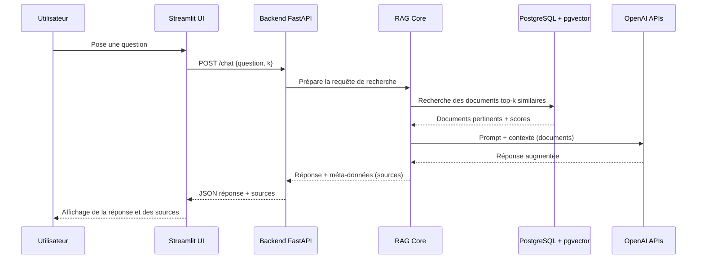
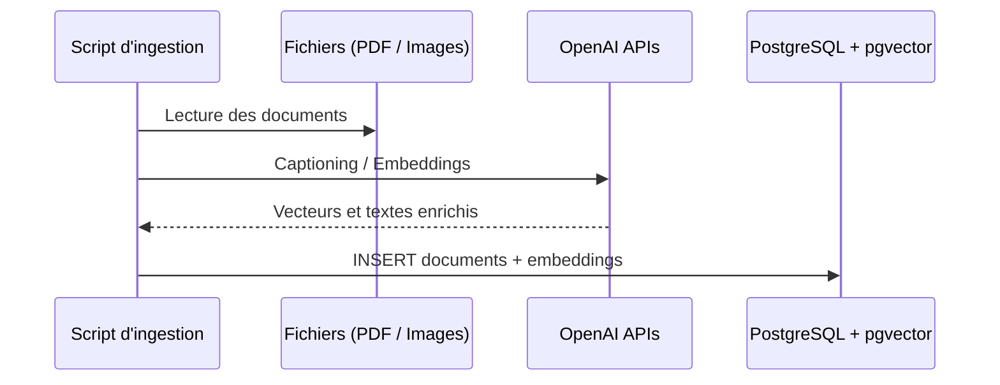

# postgres-course-rag-assistant

Assistant RAG multimodal qui répond aux questions sur des cours universitaires en s'appuyant sur une base PostgreSQL + pgvector et les API OpenAI. Le projet inclut un pipeline d'ingestion, un backend FastAPI et une interface Streamlit pour le chat.

## 🚀 Fonctionnalités clés

- **Récupération augmentée** à partir d'un corpus de PDF et d'images indexés.
- **Embeddings OpenAI** pour la similarité vectorielle avec pgvector.
- **API FastAPI** exposant un endpoint `/chat` consommé par la web app.
- **Interface Streamlit** pour poser des questions et visualiser les sources.
- **Pipeline d'ingestion** automatisé pour PDF et images (captioning + embeddings).


### Diagramme de communication (requête `/chat`)



### Diagramme de communication (ingestion)



## 🗂️ Structure du projet

```
postgres-course-rag-assistant/
├── backend/             # API FastAPI (endpoints, modèles Pydantic)
├── database/            # Connexion PostgreSQL + pgvector
├── frontend/            # Interface Streamlit
├── images/              # Captures d'écran pour la documentation
├── ingestion/           # Script d'ingestion PDF & images
├── utils/               # Utilitaires OpenAI (embeddings, captioning)
├── data/                # Documents sources à indexer (PDF, images)
├── docker-compose.yml   # Conteneur PostgreSQL + pgvector
└── README.md
```

## ⚙️ Prérequis

- Python 3.11+
- [Poetry](https://python-poetry.org/) ou `pip` classique
- Compte OpenAI + clé API valide (`OPENAI_API_KEY`)
- Docker & Docker Compose pour pgvector

## 🛠️ Installation & Configuration

1. **Cloner le dépôt**
   ```bash
   git clone https://github.com/votre-org/postgres-course-rag-assistant.git
   cd postgres-course-rag-assistant
   ```

2. **Configurer l'environnement**
   - Copier `.env.example` vers `.env` (ou créer `.env`) et renseigner :

     | Variable        | Description                                  |
     |-----------------|----------------------------------------------|
     | `OPENAI_API_KEY`| Clé API OpenAI                               |
     | `PG_HOST`       | Hôte PostgreSQL (ex. `localhost`)            |
     | `PG_PORT`       | Port PostgreSQL (ex. `5432`)                 |
     | `PG_DB`         | Base de données (ex. `ragdb`)                |
     | `PG_USER`       | Utilisateur PostgreSQL (ex. `raguser`)       |
     | `PG_PASSWORD`   | Mot de passe PostgreSQL (ex. `ragpass`)      |

3. **Installer les dépendances Python**
   ```bash
   python -m venv .venv
   .venv\Scripts\activate  # sous Windows
   pip install -r requirements.txt
   pip install -r backend/requirements.txt
   ```

4. **Lancer PostgreSQL + pgvector**
   ```bash
   docker compose up -d
   ```

5. **Initialiser la base** (assurez-vous que la table `documents` existe avec une colonne `embedding` de type `vector`).

## 📥 Ingestion des données

1. Déposez vos PDF et images dans le dossier `data/`.
2. Lancez le script d'ingestion :
   ```bash
   python ingestion/ingest.py
   ```
   - Les PDF sont découpés en chunks (800 tokens) avec chevauchement.
   - Les images sont sous-titrées via OpenAI avant vectorisation.
3. Vérifiez que les documents sont insérés dans la table `documents`.

## ▶️ Lancement des services

1. **Backend FastAPI**
   ```bash
   uvicorn backend.main:app --reload --port 8000
   ```
   Endpoint principal : `POST /chat`

2. **Frontend Streamlit**
   ```bash
   streamlit run frontend/app.py
   ```
   Ouvrez [http://localhost:8501](http://localhost:8501) pour utiliser l'interface.

## 📡 API

- `GET /health` : vérifie l'état du service.
- `POST /chat` : corps JSON `{ "question": "...", "k": 5 }`
  - Retourne `answer` (texte) et `sources` (liste des chunks, sources et scores).

## 🔍 Dépannage

- **Erreur de connexion PG** : vérifiez l'état du conteneur docker et les variables `PG_*`.
- **Réponse vide** : assurez-vous que le script d'ingestion a été lancé et que l'API OpenAI est accessible.
- **Quota OpenAI** : surveillez l'utilisation, les embeddings et captionings consomment des crédits.

## 📸 Captures d'écran

| UI | Description |
|----|-------------|
|  | Écran principal Streamlit avec zone de question. |
|  | Affichage de la réponse générée. |
|  | Détails des sources et scores par chunk. |

## 🤝 Contributions

Les contributions (issues, PR) sont les bienvenues ! Pensez à exécuter le linting et à documenter vos modifications.

## 📄 Licence

Ce projet est proposé sous licence MIT (adapter selon vos besoins).
